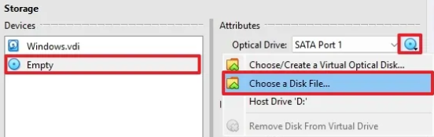
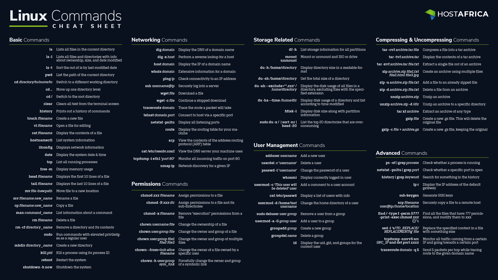

# Introduction

## Setup Linux on VW

1. Install VM (e.g. VirtualBox)
    - RAM 4GB
    - CPU 2
    - Storage 25-30GB
    - Use EFI false
2. Install Linux (e.g. Ubuntu) -> use LTS (long term support)
    - In VirtualBox go to Settings -> Storage 
    - Choose the drive from the devices and then "Choose a Disk File"

    "

    - After Linux was installed remove disk from virtual drive
3. Shared folder/clipboard
    - Settings -> General -> Shared Clipboard -> Host to Guest
    - Install VirtualBox Extension Pack
    - Run Linux and click "Devices" in the menu bar and choose "Guest Additions"
    - Click disk drive and run "autorun.sh" (run as program)
    - Unmount disk

## Linux file system

| Directory  | Info                                                                |
|------------|---------------------------------------------------------------------|
| /home      | Home directory of the user                                          |
| /root      | Directory for root user                                             |
| /bin       | Basic commands                                                      |
| /sbin      | System relevant commands                                            |
| /lib       | Libararies for commands                                             |
| /usr       | Historicaly the directory of the user (before /home)                |
| /usr/local | Programs available for all users                                    |
| /opt       | Third party apps. This programs are not split into /bin, /lib, etc. |
| /boot      | Things for system boot                                              |
| /etc       | System config                                                       |
| /dev       | Devices like mouse, keyboard, etc.                                  |
| /var       | System logs, cache                                                  |
| /tmp       | Temp folder                                                         |
| /media     | Removable media                                                     |
| /mnt       | Temporary mounted                                                   |

- Hidden files (dotfiles) -> file name starts with a "."

## CLI

jacko@ubuntuVM:~$

- user name: jacko
- computer name: ubuntuVM
- ~: home directory
- $: regular user (#: root user)

### CLI commands



## Package manager

### APT
| Command | Info                                                                   |
|---------|------------------------------------------------------------------------|
| search  | e.g. sudo search java -> get a list of all available packages for Java |
| install | Install package                                                        |
| upgrade | Upgrade a installed package                                            |
| remove  | Remove a installed package                                             |

### APT vs. APT-GET
APT is the more user-friendly variant.

### Repository
- The place where the packages are stored
- APT sources configuration file: /etc/apt/sources.list
- Adding repository: add-apt-repository
  - PPA (Personal Package Archive) -> NOTE: Everyone can add repositories. Therefore, there could be some security issues.

### SNAP
- Alternative to APT
- Self-contained packages -> NOTE: In some cases this means that dependencies are installed multiple times.

## VIM


## Users and Permissions

- Users: 
  - root
  - standard user 
  - service account (on servers)
- Permissions: 
  - user level
  - group level
- /etc/passwd -> all users on the system
- /etc/group -> all groups on the system

| Command                       | Info                                                                                |
|-------------------------------|-------------------------------------------------------------------------------------|
| adduser                       | Add a new user                                                                      |
| passwd                        | Change password                                                                     |
| su -                          | Login as root                                                                       |
| addgroup                      | Add a new group                                                                     |
| sudo usermod -g devops tom    | Add user "tom" to the group "devops"                                                |
| sudo delgroup tom             | Delete group "tom"                                                                  |
| sudo usermod -G admin tom     | Add user "tom" to subgroup "admin"                                                  |
| sudo usermod -aG admin tom    | Add (append) user "tom" to subgroup "admin" without deleting user from other groups |
| groups                        | Show group(s) of a user                                                             |
| sudo gpasswd -d nicole devops | Remove user "nicole" from group "devops"                                            |

### File permissions

| Command                       | Info                                                                                               |
|-------------------------------|----------------------------------------------------------------------------------------------------|
| ls -l                         | Show permissions                                                                                   |
| ls -la                        | Show hidden files also                                                                             |
| sudo chown tom:admin test.txt | Change ownership of the file test.txt. User "tom" owns this file and the assoated group is "admin" |
| sudo chown admin test.txt     | Change ownership of the file test.txt to user "admin" and keep the group the same                  |
| sudo chgrp devops test.txt    | Change the group of teh file test.txt                                                              |
| sudo chmod -x api             | Delete execute permission of folder "api" for all users                                            |
| sudo chmod g-w config.yaml    | Remove write permission from group on file "config.yaml"                                           |
| sudo chmod g+x config.yaml    | Add execute permission for group on file "config.yaml"                                             |
| sudo chmod u-w config.yaml    | Remove write permission from user on file "config.yaml"                                            |
| sudo chmod u+x config.yaml    | Add execute permission for user on file "config.yaml"                                              |

### Permissions shown in the terminal

| filetype   | user/owner | execute     | group     | execute     | other     | execute     |
|------------|------------|-------------|-----------|-------------|-----------|-------------|
| "d" or "-" | "r", "w"   | "x" or "-"  | "r", "w"  | "x" or "-"  | "r", "w"  | "x" or "-"  |

### Pipes & Redirects

| Command                     | Info                                                                                |
|-----------------------------|-------------------------------------------------------------------------------------|
| \|                          | Pipe                                                                                |
| less                        | List page by page, e.g. history \| less; "space" -> next page, "p" -> previous page |
| grep                        | Seach for a given value                                                             |
| \>                          | Redirect -> overwrite the containt of an existing file                              |
| \>>                         | Redirect -> append to an existing file                                              |
| clear; sleep2; echo "hello" | Execute multiple commands in a row.                                                 |

## Shell scripting

- shebang (e.g. "#!/bin/bash") tells the system what shell to use
- run a .sh file: ./setup.sh -> Run file setup.sh. The user needs the permission to execute the file (sudo chmod u+x setup.sh)

### Reference variable

$

### Parameters

\$1, \$2, ..., \$9

- \$1 is the first parameter given running the script. Nine parameters can be used.
- \$* holds a list of all given parameters
- \$# holds the number of given parameters

### User input

```bash
read -p "..." variable
```

- -p Prompt
- Input is stored in "variable"

### if Statement

```bash
if [ ... ]
then
  ...
elif [ ... ]
then
  ...
else
  ...
fi
```

### for Loop

```bash
for x in y
do
  ...
done
```

### while Loop

```bash
while ...
do
  ...
done
```

### Function

```bash
function name() {
  list of commands
  return x
}
```

If the function returns a value, this value can be accessed with "\$?"

## Environment Variables

| Command  | Info                                                                                                                           |
|----------|--------------------------------------------------------------------------------------------------------------------------------|
| printenv | Shows all environment varibles of the system                                                                                   |
| \$USER   | Use environment variable USER                                                                                                  |
| export   | Create a new environment variable (e.g. export USERNAME=username). NOTE: This variable is only available in the current season |
| unset    | Delete a environment variable                                                                                                  |

To store an environment variable permanently add the variable to the ".bashrc" file in the home directory of the user.
After adding the variable the file needs to be reloaded with command "source .bashrc".

System-wide used environment variables are stored in "/etc/environment".

## Networking

### IP address example

- IP address: 192.168.0.0
- Subnet mask: 255.255.255.0

In this example 24 bits of the IP addresses are fix. Therefore, the IP addresses can be in the range 192.168.0.x

### Commands

| Command  | Info                                |
|----------|-------------------------------------|
| ifconfig | Shows the network interface config  |
| netstat  | Network status                      |
| ps aux   | Shows what is running at the moment |
| nslookup | DNS lookup                          |
| ping     | Check connection                    |

## SSH

| Topic                                                | Info                                                                  |
|------------------------------------------------------|-----------------------------------------------------------------------|
| Authentication                                       | Using username and password or using a key pair                       |
| Port 22                                              | SSH uses port 22. Remember for firewall config                        |
| Connect to SSH                                       | e.g.: ssh root@ip-address                                             |
| Connect to SSH using an explicit key                 | e.g.: ssh -i .ssh/id_rsa root@ip-address                              |
| Generate key pair                                    | "ssh-keygen -t rsa" will generate a RSA key pair (id_rsa, id_rsa.pub) |
| Add public key to remote                             | "vim .ssh/authorized_keys" -> copy public key into this file          |
| Copy file from local to remote                       | e.g.: scp filename root@ip-address:/root                              |
| Copy file from loaal to remote using an explicit key | e.g.: scp -i .ssh/id_rsa filename root@ip-address:/root               |