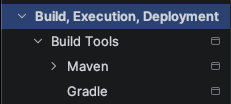
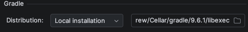
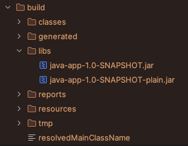
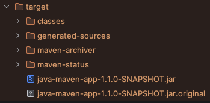
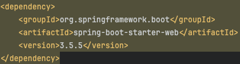
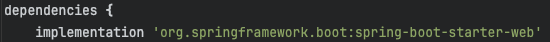
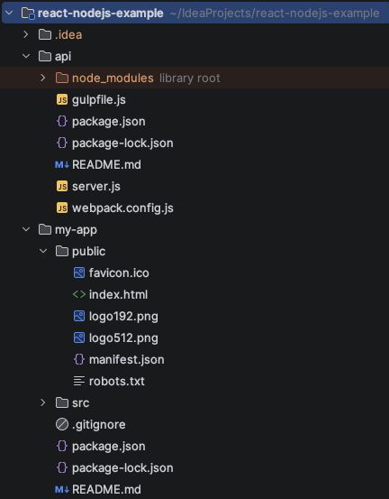

# Build tools and Package Manager tools

- An *Artifact* is a single movable file
- An *Artifact repository* is the storage for artifacts
- Examples for artifacts:
  - A Java artifact is a *JAR*
  - A JS artifact is a *ZIP* or *TAR*

## Installation

### Windows

#### Java

- Add the Java path to the environment variables *System Variables* -> *Path* -> add path to Java's ...\bin folder

#### Maven

- Pre-requisites
  - Java SDK
  - Java path added to Path environment variable
  - Add *JAVA_HOME* environment variable with value *path to JDK* folder
- Install Maven
  - Go to https://maven.apache.org/download.cgi and download Maven
  - Follow the installation process
- Add the Maven path to the environment variables *System Variables* -> *Path* -> add path to Maven's ...\bin folder

#### Gradle

- Download *Gradle* from https://gradle.org/releases/
- Create new folder *C:\Gradle*
- Unzip the downloaded file and move the content to C:\Gradle
- Add the Maven path to the environment variables *System Variables* -> *Path* -> add path to Gradle's ...\bin folder
- **Intellij** *Settings* -> *Build, Execution, Development* -> *Gradle* -> set *Distribution to *local Installation* -> add *Location* to *C:\...\gradle...*

#### Node.js

- Download *Node.js* form https://nodejs.org/en/download/current (use *.msi*)
- The .msi will install *Node.js* and *npm*, and both will be added to the *Path* environmental variable automatically

### macOS

#### Homebrew

- Install Homebrew with command: */bin/bash -c "$(curl -fsSL https://raw.githubusercontent.com/Homebrew/install/HEAD/install.sh)"*
- Use *brew install* to install software on the system

#### Maven

| Command                                                                                                   | Info                               |
|-----------------------------------------------------------------------------------------------------------|------------------------------------|
| brew install openjdk@17                                                                                   | Install Java 17                    |
| sudo ln -sfn /user/local/opt/openjdk@17/libexec/openjdk.jdk /Library/Java/JavaVirtualMachines/openjdk.jdk | Creat a symlink                    |
| brew install --ignore-dependencies maven                                                                  | Install Maven without dependencies |

Run Maven with command *mvn package* in the project folder.

#### Gradle

- Install Gradle with command *brew install gradle*
- **Intellij** *Settings* -> *Build, Execution, Development* -> *Gradle* -> set *Distribution to *local Installation* -> add *Location* to the location shown in the terminal after installation

#### Node.js

- Install *Node.js* with command *brew install node*
- Node.js and npm will be installed

Run a Node.js application with command *npm start* 

## Build Artifacts

### Gradle

| Command      | Info                                                                |
|--------------|---------------------------------------------------------------------|
| gradle build | Create a *build* folder containing the *JAR* file (and other files) |

### Maven

| Command     | Info                                                                 |
|-------------|----------------------------------------------------------------------|
| mvn install | Create a *target* folder containing the *JAR* file (and other files) |

### Build tools for development

Dependencies for the project are managed in dependencies files.

| Build tool | Dependencies file | Example                                                    |
|------------|-------------------|------------------------------------------------------------|
| Maven      | pom.xml           |       |
| Gradle     | build.gradle      |  |

- Dependencies are available in repositories for each Maven and Gradle
- Run a Java application with the command *java -jar <jar-file-name>*

### Node.js

- Node.js applications are build as a *ZIP* or *TAR* archives. These archives include the application code, 
but not the dependencies. Therefore, dependencies need to be installed separately. 
- Node.js applications are not as structured and standardized.
- Package managers amongst others are *npm* (https://www.npmjs.com) or *yarn* (https://yarnpkg.com)
- Dependencies are managed with package.json files

| Command     | Info                                                  |
|-------------|-------------------------------------------------------|
| npm install | Install dependencies defined in the package.json file |
| npm pack    | Create an artifact                                    |
| npm start   | Run the application locally                           |

#### Frontend

Frontend and backend artifacts can have a common artifact file (both JS code) or packed separately
(Example: frontend and backend code can have its own folders in the project)

**NOTE** 
Frontend/React code needs to be transpiled to make sure it will work in all browsers.

#### Webpack

Webpack is a build tool.

| Command       | Info                                                 |
|---------------|------------------------------------------------------|
| npm install   | Will install webpack if included in the package.json |
| npm run build | Calls webpack                                        |

## Common concepts and differences of build tools

### Common

- dependency file
- repository for dependencies
- command line tools
- package manager

## Publish an artifact

### Docker

#### Docker Image

- The docker image is an artifact
- Executes everything in the Image
- Build the application is still needed. The application is packed into a docker image after it was build.

#### Dockerfile

- Contains the information needed to create a Docker image

## Build tools for DevOps

- Help developers building the applications
- Configure the build automation tools or CI/CD pipelines