# Artifact repository manager - Nexus

## Terms

| Term                |                                      |
|---------------------|--------------------------------------|
| Aritfact            | Application build into a single file |
| Artifact repository | Storage for artifacts                |

## Nexus

- Upload, store and retrieve artifacts
- Central storage
- Host own repositories (internal use) or proxy repositories (publicly available)

**Features**

- LDAP
- REST API
- Backup and restore
- Multi-format support
- Metadata (labelling and tagging)
- Cleanup policies
- Search functionality
- User token support (for system users)

### Install and run Nexus

Create a Droplet with 8GB RAM.

1. Connect to droplet via SSH ```ssh root@<droplet-ip-address>```
2. ```cd /opt```
3. Go to sonatype.com webside (https://help.sonatype.com/en/download.html) and copy the download link
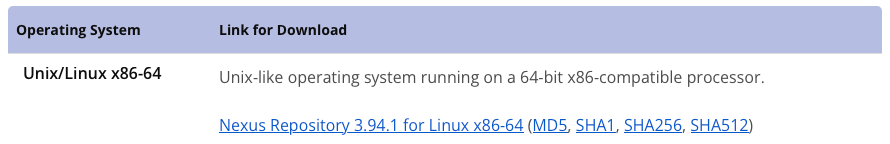
4. Get Nexus
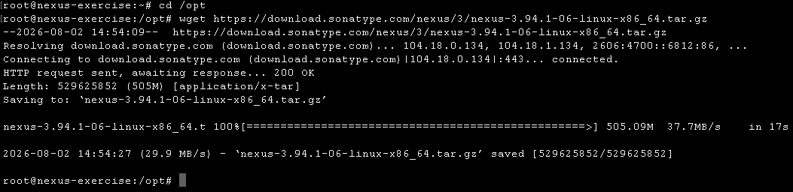
5. Unpack the downloaded archive ```tar -zxvf nexus-3.94.1-06-linux-x86_64.tar.gz```
6. 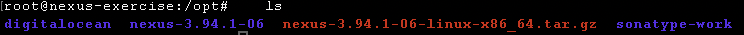
7. Create a Nexus user ```adduser nexus```
8. Change ownership for both the nexus and sonatype-work folder
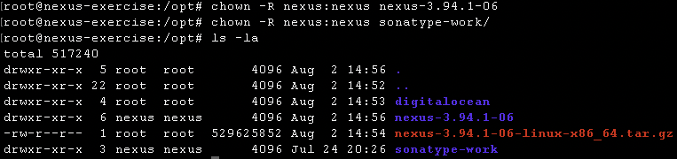
9. Update ```vim nexus-3.94.1-06/bin/nexus.rc``` with ```run_as_user="nexus"```
10. Change user ```su - nexus```
11. Start Nexus and check port number
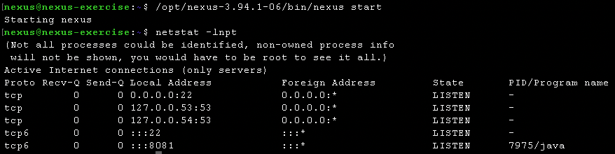
12. Add port number to firewall rules of the droplet

**Nexus folders**

| Folder          | Info                                                                                                     |
|-----------------|----------------------------------------------------------------------------------------------------------|
| nexus-3.94.1-06 | Contains runtime and application of Nexus.                                                               |
| sonatype-work   | Contains own config and data. Update will not replace this folder. This folder is also used for backups. |


### Nexus UI

Nexus will create a new user "admin" with a default password for the first login.

### Nexus repository types

| Type       | Info                                                                                                                           |
|------------|--------------------------------------------------------------------------------------------------------------------------------|
| **proxy**  | - Linked to a remote repository (e.g., maven-central)<br/> - Act as a cache<br/> - Single endpoint for everyone                |
| **hosted** | - Primary storage<br/> - Integrated version policies<br/> - Internal releases and not external available thirdparty components |
| **group**  | - One endpoint for multiple repositories and/or groups                                                                         |

### Publish artifact

- Create Nexus user
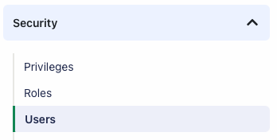
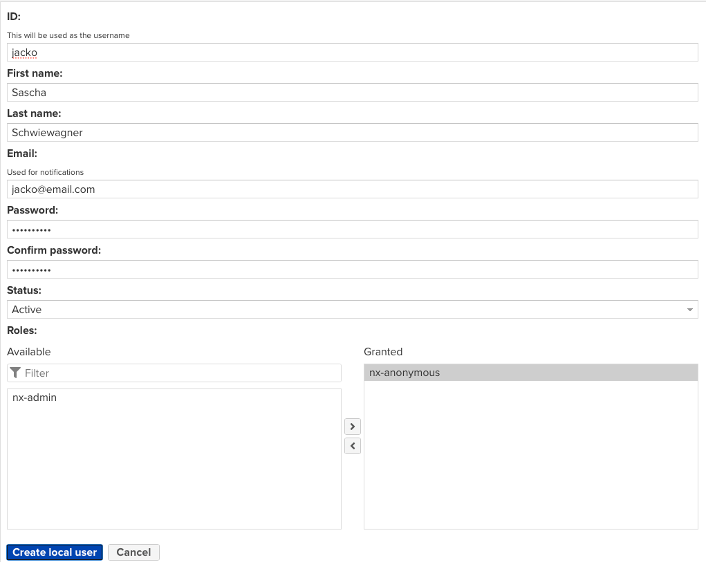

- Create Nexus role
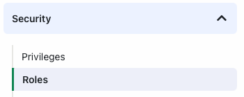
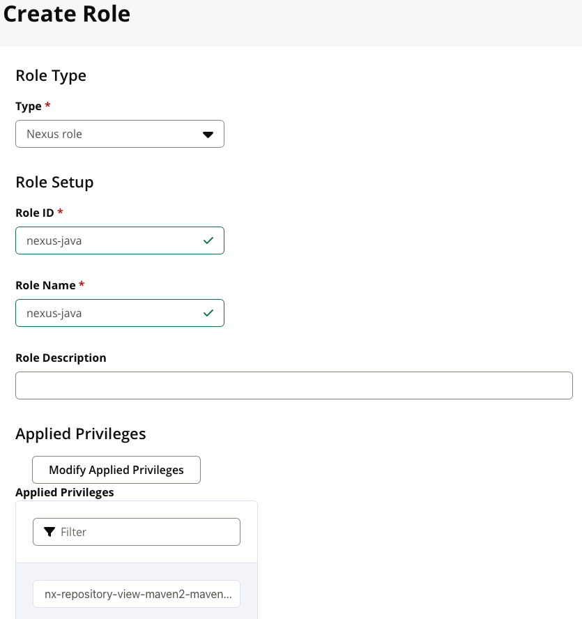
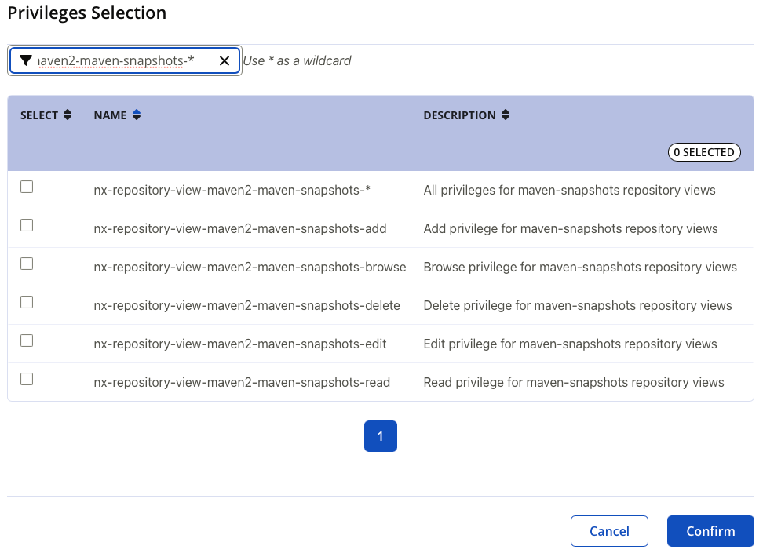

#### Gradle

- build.gradle<br>
Add *plugin* and *publishing* section. The line *allowInsecureProtocol = true* is
needed because we use *http*.

```java
apply plugin: 'maven-publish'

publishing {
    publications {
        create("maven", MavenPublication){
            artifact("build/libs/my-app-$version" + ".jar"){
                extension 'jar'
            }
        }
    }

    repositories {
        maven{
            name 'nexus'
            url "http://165.232.120.17:8081/repository/maven-snapshots/"
            allowInsecureProtocol = true
            credentials{
                username project.repoUser
                password project.repoPassword
            }
        }
    }
}
```
- gradle.properties<br>
Create a properties file for the credentials needed to upload to Nexus. In this example
*username* and *password* are stored in the file and can be used with *project.repoUser*
and *project.repoPassword* (see above).

```java
repoUser = jacko
repoPassword = jacko!user
```
- settings.gradle<br>
The application name can be defined in the *settings.gradle* file.

```java
rootProject.name = 'my-app'
```
- Build Gradle artifact

```bash
build gradle 
```
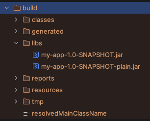

- Publish Gradle artifact

```bash
gradle publish
```
Note: The *publish* command is not available for Gradle by default. It was added
with the plugin *apply plugin: 'maven-publish'* in the *build.gradle* file.

#### Maven

*pom.xml*

- Add *plugin*

```xml
<plugin>
    <groupId>org.apache.maven.plugins</groupId>
    <artifactId>maven-deploy-plugin</artifactId>
    <version>3.1.4</version>
</plugin>
```

- Add *distributionManagement* to configure the Nexus repository

```xml
<distributionManagement>
    <snapshotRepository>
        <id>nexus-snapshots</id>
        <url>http://164.92.135.47:8081/repository/maven-snapshots</url>
    </snapshotRepository>
</distributionManagement>
```

*.m2* folder

- Create new file *settings.xml* for Maven global credentials and add

```xml
<settings>
    <servers>
        <server>
            <id>nexus-snapshots</id>
            <username>jacko</username>
            <password>jacko!user</password>
        </server>
    </servers>
</settings>
```

- Create Maven artifact

```
mvn package
```

- Publish Maven artifact

```
mvn deploy
```