# Build automation & CI/CD with Jenkins

## Install Jenkins

1. Create a new Droplet (minimum 1GB RAM, better 4GB)
2. Change Droplet name
3. Edit firewall settings
    - Open port 22 for SSH
    - Open port 8080 (custom) for Jenkins
   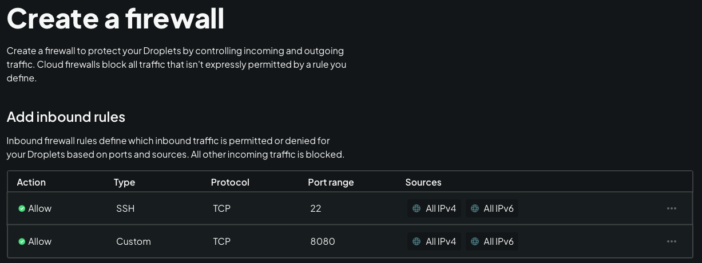
4. SSH into Droplet ```ssh root@<droplet IP address>```
5. ```apt upgrade```
6. ```apt install docker.io```
7. ```docker run -p 8080:8080 -p 50000:50000 -d -v jenkins_home:/var/jenkins_home jenkins/jenkins:lts```

## Initialize Jenkins

1. ```docker exex -it <container ID> bash```
2. ```cat /var/jenkins_home/secrets/initialAdminPassword```
3. Use initial admin password for first login
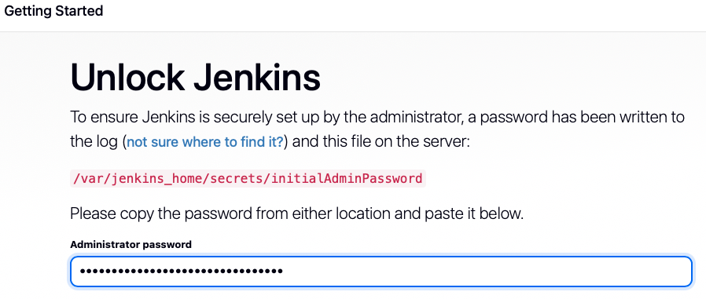
4. Install suggested plugins
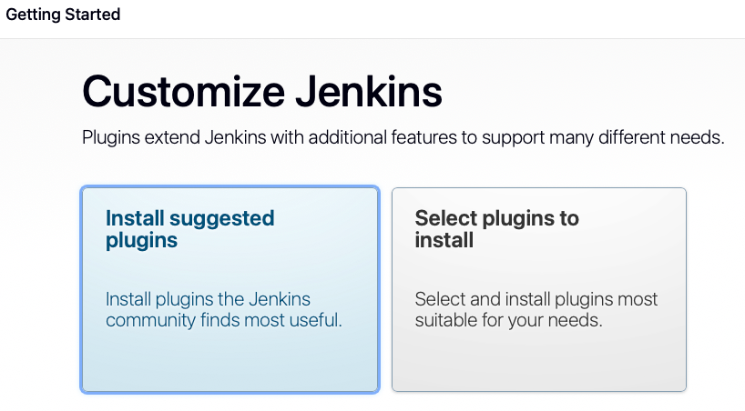
5. Create admin user
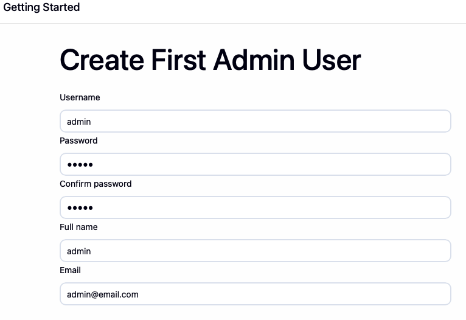

Note: The initial admin password can also be found outside the container.

The command ````docker volume inspect jenkins_home```` will return a JSON
including the "Mountingpoint" path. Within this path the *secrets* folder
can be found.

## Jenkins UI

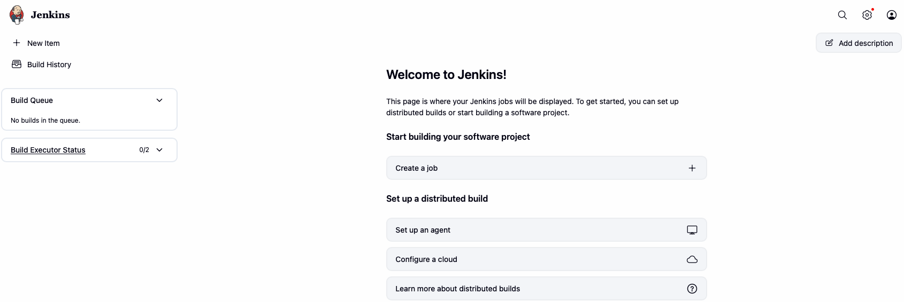

## Install build tool in Jenkins

**Maven plugin**

Install Maven plugin via Jenkins UI.
- Go to "Manage Jenkins" <br>
- Open "Tools"
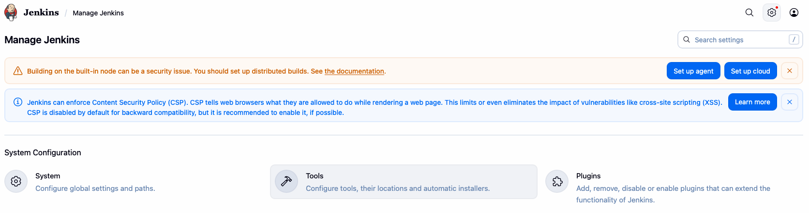
- Add Maven
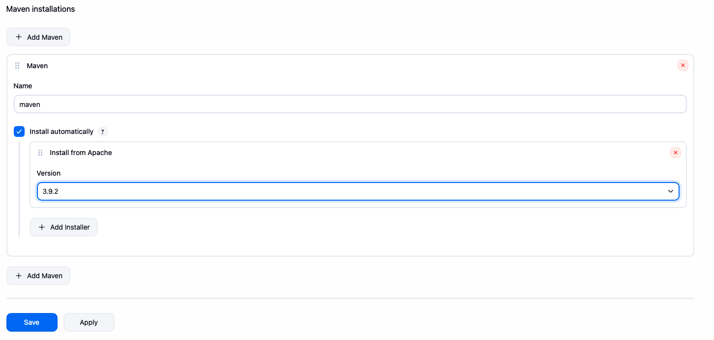
- Save

**npm and Node.js**

Install npm and Node.js via terminal
- ```docker exec -u 0 -it <container ID> bash``` (0 = root user)
- Check Linux distribution ```cat /etc/issue```. This will return the Linux
distribution running in the container (e.g., ```Debian GNU/Linux 13 \n \l```)
- ```apt update```
- ```apt install curl```
- ```curl -sL https://deb.nodesource.com/setup_20.x -o nodesource_setup.sh```
- ```bash nodesource_setup.sh```
- ```apt install nodejs```

**Stage View plugin**

Install Stage View plugin via Jenkins UI.
- Go to "Manage Jenkins" <br>
- Open "Plugins"
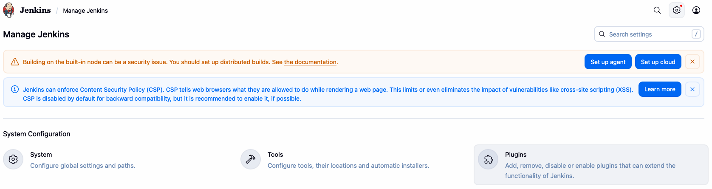
- Search for Stage View plugin
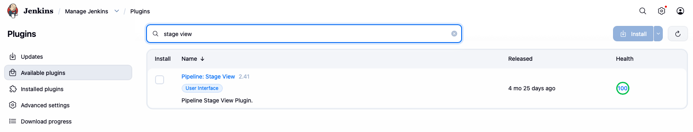
- Install after restart
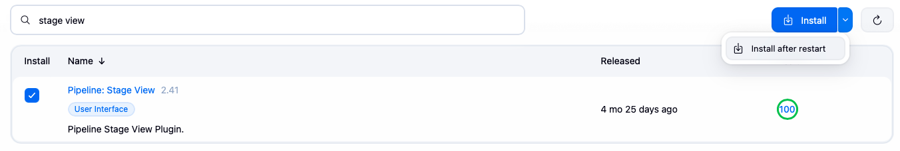
- Restart Jenkins container
  - Get container ID ```docker ps -a```
  - Start container ```docker start <container ID>```

## Jenkins - Freestyle Job

**Create new Freestyle Job**

- Create a new freestyle job
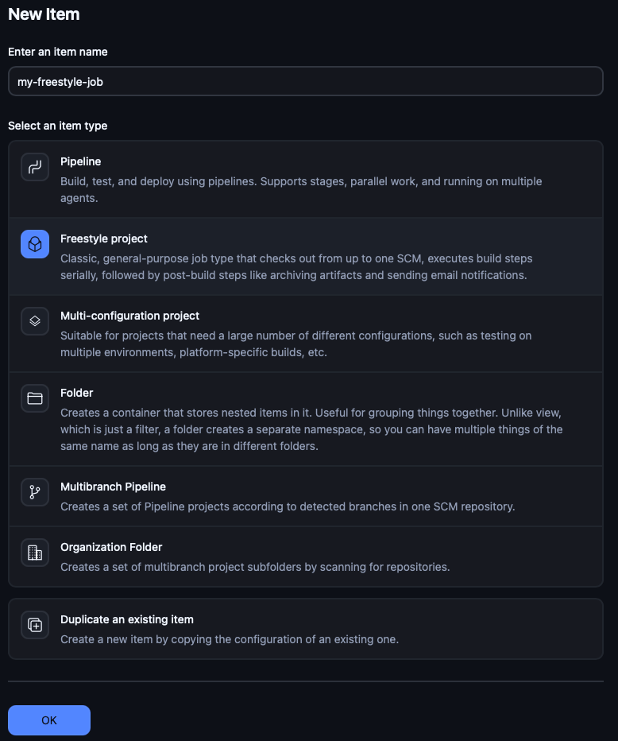
- Add build steps
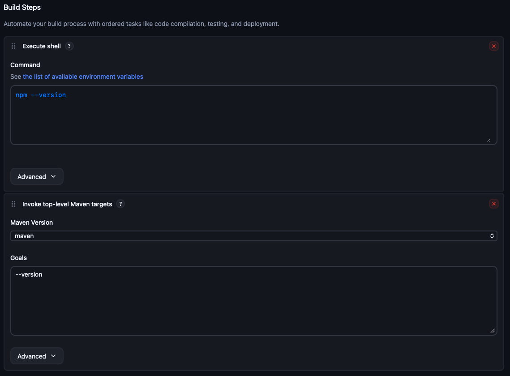
  - npm was installed directly in the Docker container. Therefore, it is possible
  to run npm command in a shell.
  - Maven was installed as a plugin in Jenkins. Therefore, Maven can be configured
  using a Jenkins template. This is not as flexible as running commands in a shell.

Note: More plugins (e.g., Node.js) can be installed directly in Jenkins to use it in the build steps.

**Run the job**

Run the Jenkins job with "Build Now". After the job finished the result is
shown in the "Builds" section at the bottom.

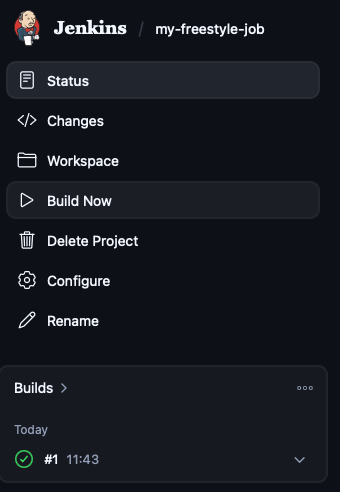

*Console Output*

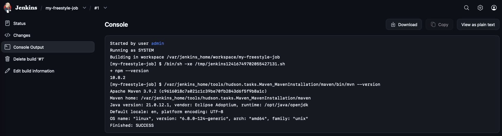

**Source Code Management**

Jenkins pipelines can use code directly from a source code management tool like Gitlab.

*Configure Source Code Management for the job*

- Add repository URL
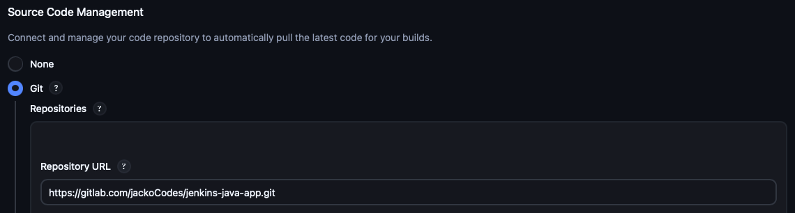
- Configure credentials to excess the repository
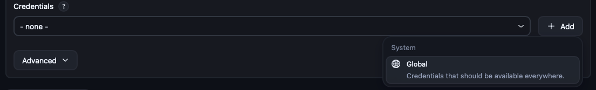
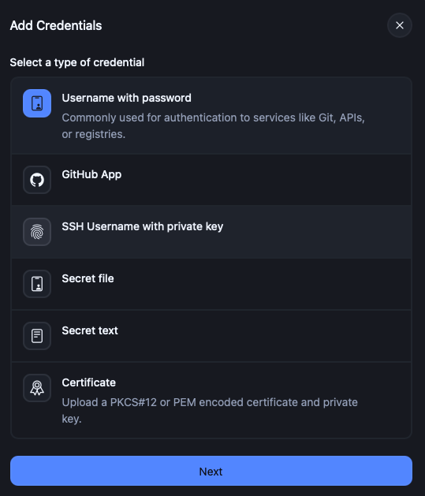
- Select branch to build
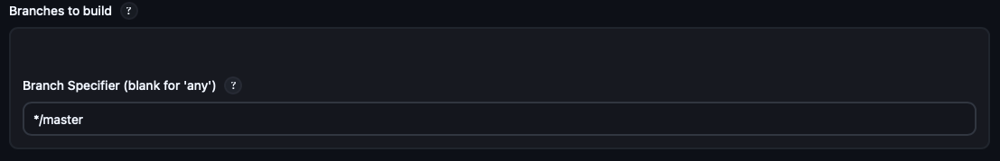

*Check job output*

```docker exec -it <container ID> bash```

The output of the Jenkins job can be found in ```/var/jenkins_home/workspace/```.
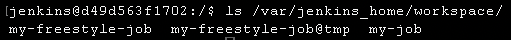

- *my-freestyle-job* contains the source code and the job output (e.g., jar file).
- *my-freestyle-job@tmp* is used as a temp folder while the job is running.

## Docker in Jenkins

**Setup for Docker in Jenkins**
- Stop running Jenkins container ```docker stop <container ID>```
- ```docker run -p 8080:8080 -p 50000:50000 -d -v jenkins_home:/var/jenkins_home -v /var/run/docker.sock:/var/run/docker.sock jenkins/jenkins:lts```
- ```docker exec -u 0 -it <container ID> bash```
- ```curl https://get.docker.com/ > dockerinstall && chmod 777 dockerinstall && ./dockerinstall```
- ```chmod 666 /var/run/docker.sock```
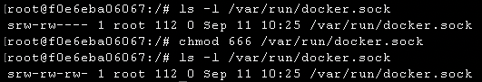

## Build Docker image

To build a Docker image from the source code a build step with the Docker command is added
(*-t* used to specify the name of the image).
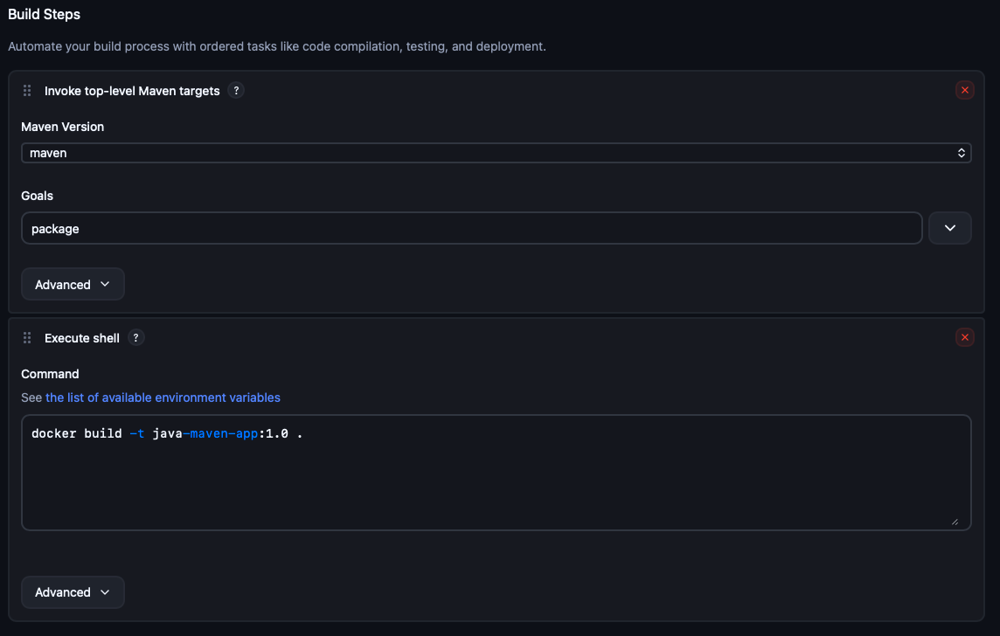

**Console output**

```
...
[my-freestyle-job] $ /bin/sh -xe /tmp/jenkins16358888609287328001.sh
+ docker build -t java-maven-app:1.0 .
#0 building with "default" instance using docker driver

#1 [internal] load build definition from Dockerfile
...
Finished: SUCCESS
```

**Docker image**

Run ```docker images``` in the terminal to get all available images.

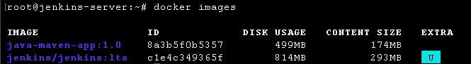

**Push Docker image to Docker Hub**

*Create Docker Hub repository*

Create a new (private) Docker Hub repository.
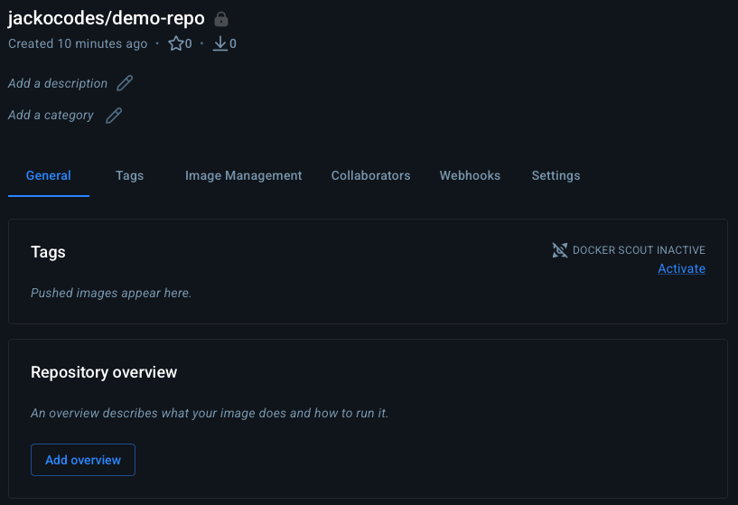

*Configure Jenkins*
- Add credentials for Docker Hub login
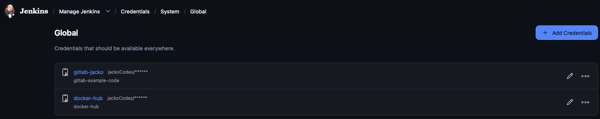
- Update Jenkins job
  - Add Docker Hub credentials to the job environment
  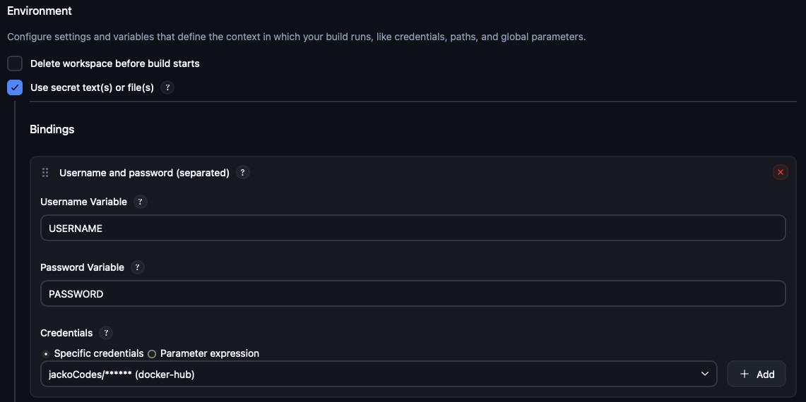
  - Update build step
  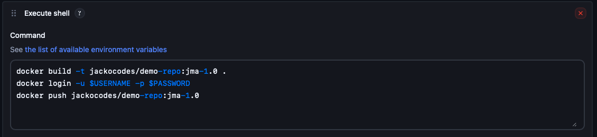
  Note: The better way to provide the password is ```echo $PASSWORD | docker login -u $USERNAME --password-stdin```

**Push Docker image to Nexus**

- Because Nexus is an unsecure (http) connection a *daemon.json* needs to be created
  (```vim /etc/docker/daemon.json```)
    ```json
    {
      "insecure-registries": ["<Nexus IP address>:<Docker repo port>"]
    }
    ```
- Restart Docker to apply the changes (```systemctl restart docker```)
- Start Jenkins container (```docker start <container ID>```)
- ```docker exec -u 0 -it <container ID> bash```
- ```chmod 666 /var/run/docker.sock```
- Add credentials for Nexus in Jenkins and update credentials in the job environment
- Update build step in the Jenkins job
    ```shell
    docker build -t <Nexus IP address>:<Nexus port>/java-maven-app:1.1 .
    echo $PASSWORD | docker login -u $USERNAME --password-stdin <Nexus IP address>:<Nexus port> # Repo needs to be specified explicit
    docker push <Nexus IP address>:<Nexus port>/java-maven-app:1.1 
    ```
  
## Freestyle to Pipeline job

Using Freestyle jobs has limitations because in the most cases templates are
used to configer build steps. Also chaining Freestyle jobs to a Pipeline is
not a good solution. Therefore, the use of Pipeline jobs is recomended.
Pipelines are build with scripts (Pipeline as code).

## Pipeline Jobs

- Create a new Jenkins pipeline.
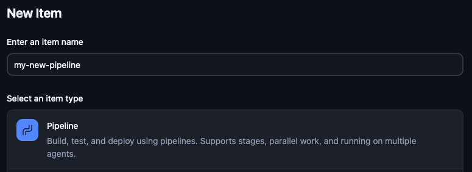
- There are now two options how to write the pipeline script:
  1. Write the pipeline script in Jenkins.
  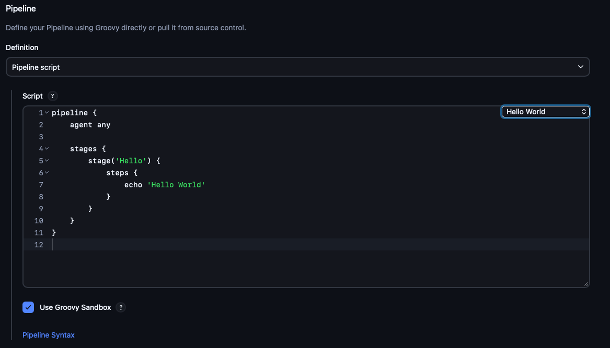
  2. Use a pipeline script from SCM (best practise).
  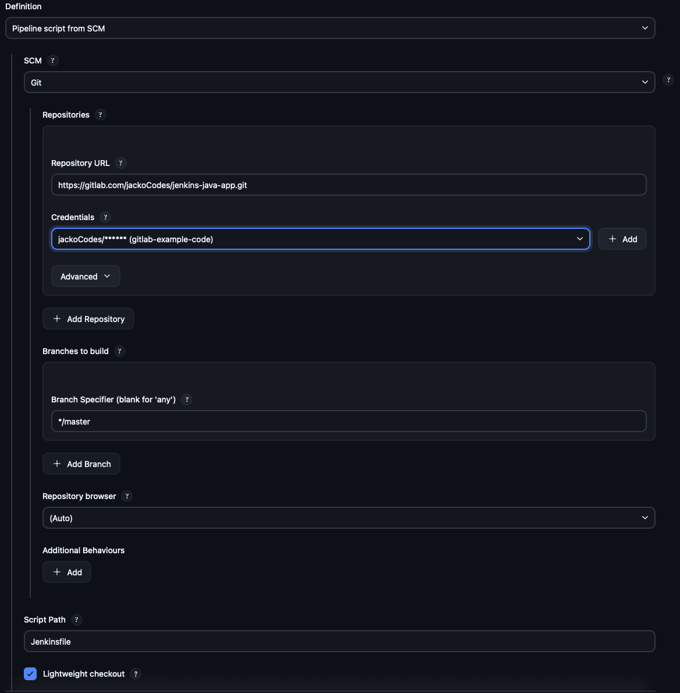
- Define Jenkinsfile. The following example is in declarative form.
    ```
    pipeline {
    
        agent any
    
        stages {
    
            stage("build") {
                steps {
                    echo 'building the application...'
                }
            }
    
            stage("test") {
                steps {
                    echo 'testing the application...'
                }
            }
    
            stage("deploy") {
                steps {
                    echo 'deploying the application...'
                }
            }
        }
    }
    ```
- Run the pipeline. The result is shown in the *Stage View*.
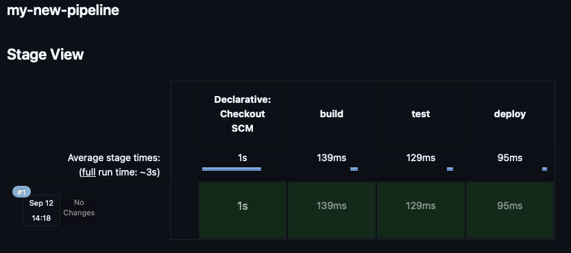
- Console output.
    ```
    Started by user admin
    Obtained Jenkinsfile from git https://gitlab.com/jackoCodes/jenkins-java-app.git
    [Pipeline] Start of Pipeline
    [Pipeline] node
    Running on Jenkins in /var/jenkins_home/workspace/my-new-pipeline
    [Pipeline] {
    [Pipeline] stage
    [Pipeline] { (Declarative: Checkout SCM)
    [Pipeline] checkout
    ...
    [Pipeline] stage
    [Pipeline] { (build)
    [Pipeline] echo
    building the application...
    ...
    [Pipeline] stage
    [Pipeline] { (test)
    [Pipeline] echo
    testing the application...
    ...
    [Pipeline] stage
    [Pipeline] { (deploy)
    [Pipeline] echo
    deploying the application...
    ...
    [Pipeline] End of Pipeline
    Finished: SUCCESS
    ```
  
**Pipeline Jobs pros**

- Want to execute two tasks in parallel.
- Need user input.
- Conditional statements.
- Set variables.
- Not limited!
- One job with multiple stages.

**Freestyle Jobs cons**

- Relying on plugins.
- Different plugins in multiple jobs.
- Manage those plugins.
- Manage all jobs.
- Edit in UI.