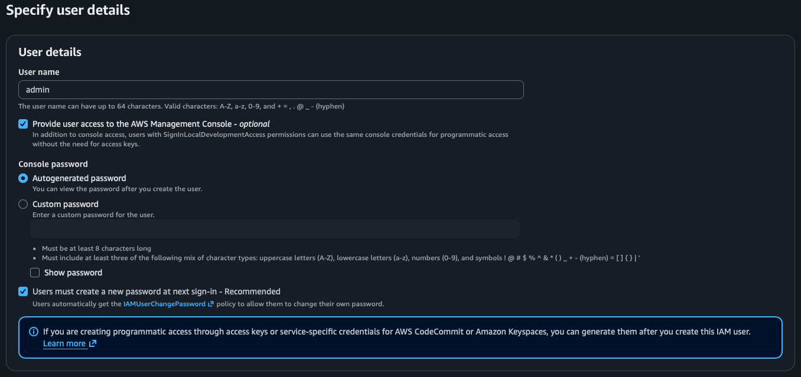
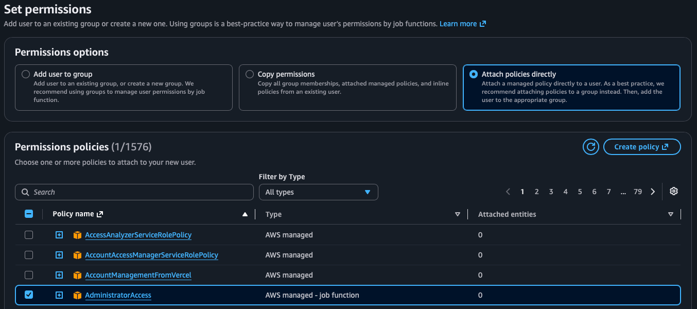
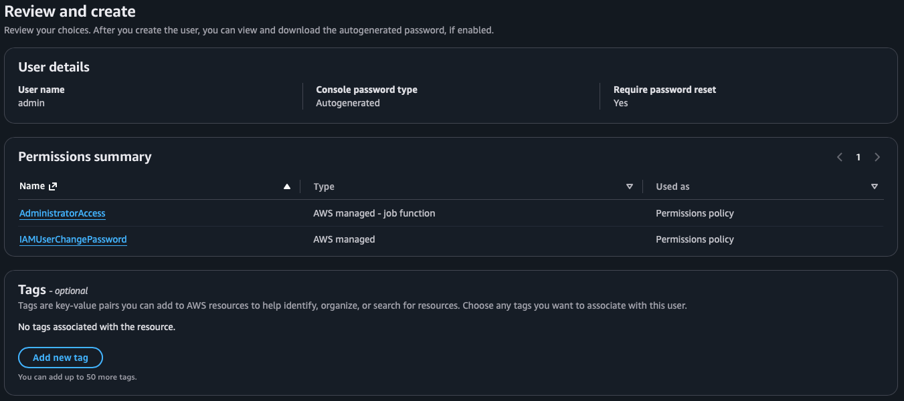
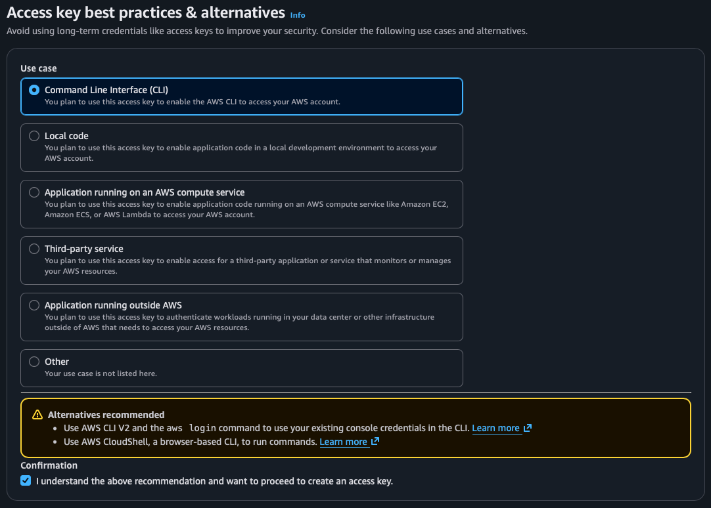
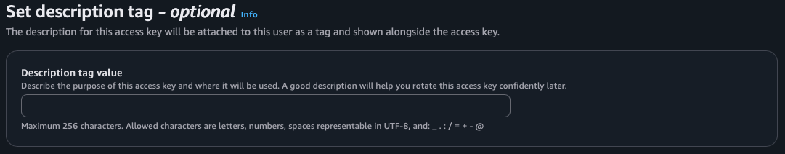

# AWS Services

## Introduction

**Services**

| Service                         | Info |
|---------------------------------|------|
| Compute                         | EC2  |
| Storage                         | S3   |
| Database                        |      |
| Networking                      | VPC  |
| Security, Identity & Compliance | IAM  |
| Containers                      |      |

## Scope

| Scope                  | Services and info     |
|------------------------|-----------------------|
| AWS Account            | IAM, Billing, Route53 |
| Region                 | S3, VPC, DynomoDB     |
| Availability zone (AZ) | EC2, EBS, RDS         |

## Identity and Access Management (IAM)

| IAM   | Info                                           |
|-------|------------------------------------------------|
| Users | Human or system users                          |
| Roles | AWS services and policies specific to services |

**Create *admin* user**

Note: Best practice is to assign permissions to *groups* and assign a group to a *user*.
In case of the user *admin* the permission can be assigned directly.

*Programmatic access for user admin*

This allows the user to access via the CLI.

## VPC

- Private network in the cloud.
- Virtual representation of network infrastructure.

**Subnet**

- Firewall rule configuration makes it either *private* or *public*.
- Example:   Database is running in a private subnet and the web application is running in a public subnet.
- Every subnet has an internal IP address range on the VPC level.
- Controlling access
  - Rules are created on the VPC level.
  - *Network ACLs* -> *subnet* level
  - *Security Groups* -> *instance* level

