# AWS Services

## Introduction

**Services**

| Service                         | Info |
|---------------------------------|------|
| Compute                         | EC2  |
| Storage                         | S3   |
| Database                        |      |
| Networking                      | VPC  |
| Security, Identity & Compliance | IAM  |
| Containers                      |      |

## Scope

| Scope                  | Services and info     |
|------------------------|-----------------------|
| AWS Account            | IAM, Billing, Route53 |
| Region                 | S3, VPC, DynomoDB     |
| Availability zone (AZ) | EC2, EBS, RDS         |

## Identity and Access Management (IAM)

| IAM   | Info                                           |
|-------|------------------------------------------------|
| Users | Human or system users                          |
| Roles | AWS services and policies specific to services |

**Create *admin* user**


Note: Best practice is to assign permissions to *groups* and assign a group to a *user*.
In case of the user *admin* the permission can be assigned directly.


*Programmatic access for user admin*

This allows the user to access via the CLI.


## VPC

- Private network in the cloud.
- Virtual representation of network infrastructure.

**Subnet**

- Firewall rule configuration makes it either *private* or *public*.
- Example: <br> Database is running in a private subnet and the web application is running in a public subnet.
- Every subnet has an internal IP address range on the VPC level.
- Controlling access
  - Rules are created on the VPC level.
  - *Network ACLs* -> *subnet* level
  - *Security Groups* -> *instance* level

## CIDR Blocks

Range of IP addresses.

*Example*

| IPv4 CIDR     | Range                       |
|---------------|-----------------------------|
| 172.31.0.0/16 | 172.31.0.0 - 172.31.255.255 |

IP Calculator https://mxtoolbox.com/subnetcalculator.aspx <br>
IP Calculator with binary values https://jodies.de/ipcalc?host=10.0.0.0&mask1=1&mask2=

**Sub CIDR Blocks**

A CIDR block can be divided in sub CIDR blocks for multiple subnets.

*Example*

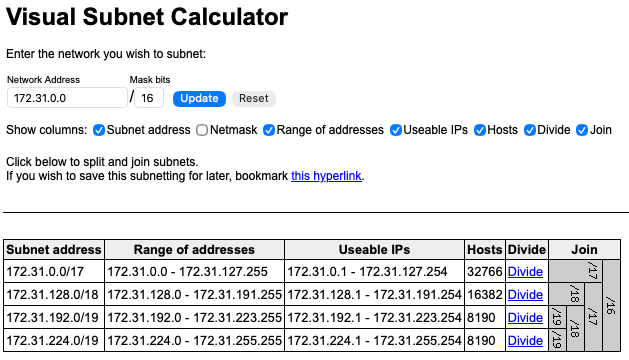

Visual subnet calculator https://www.davidc.net/sites/default/subnets/subnets.html

## EC2 Virtual Cloud Server

Repository https://gitlab.com/jackoCodes/aws-react-example#

**Launch an instance**

*Name and tags*

It is possible to assign multiple *key/value* pairs to distinguish between instances.

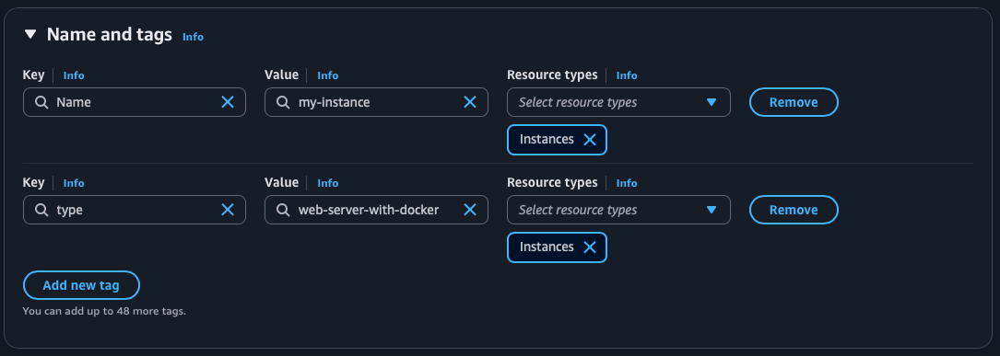

*Applications and OS Images*

*Amazon Linux* is a optimized Linux for AWS usage.

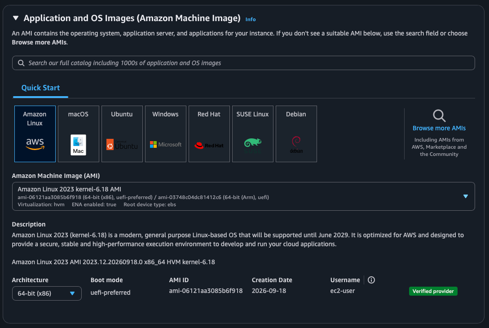

*Instance type*

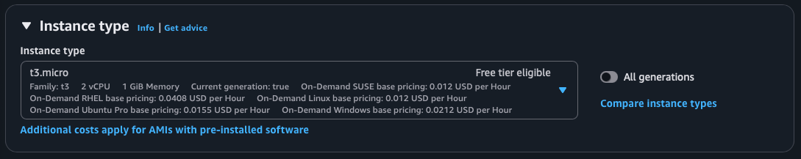

*Key pair*

Create or choose a key pair to connect to the server (e.g., SSH). 

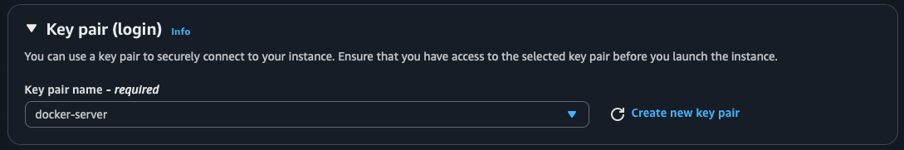

*Create key pair*

| Key file format | OS              |
|-----------------|-----------------|
| .pem            | Linux and macOS |
| .ppk            | Windows         |

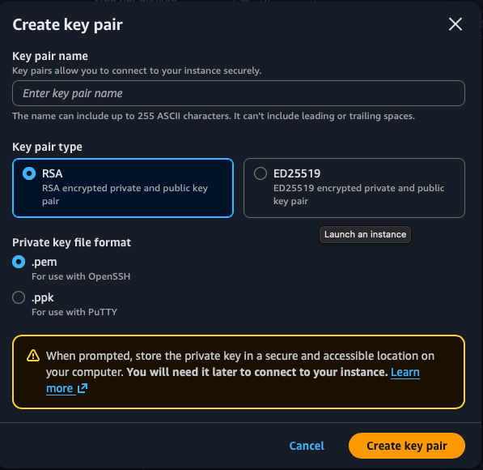

After creating the key pair the private key will be downloaded automatically.
This file needs to be stored in the *.ssh* folder.

```bash
mv Downloads/<file-name>.pem ~/.ssh/
```
Also, the access right of the file needs to be changed.

```bash
chmod 400 .ssh/<file-name>.pem
```

*Network settings*

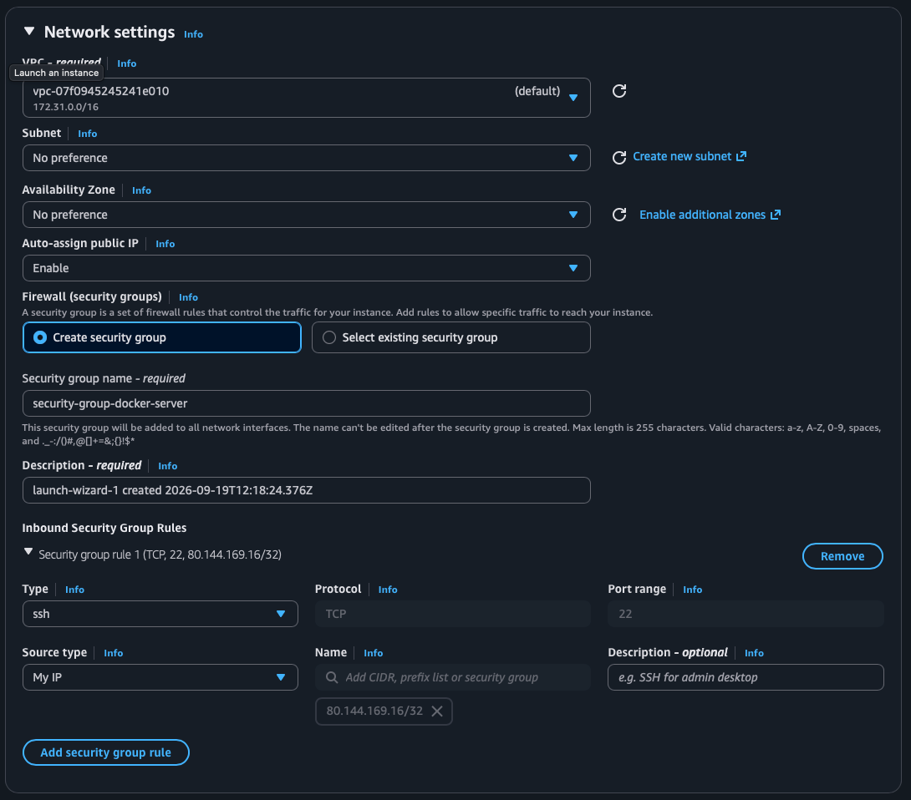

*Subnet*

The subnet in which the network interface is located. A specific subnet can be used if, for example, 
there are access rules configured.

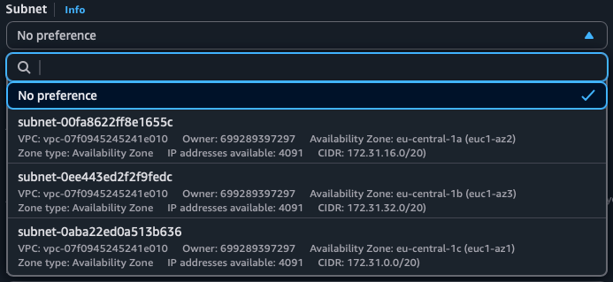

*Source type*

| Type     | Info                                               |
|----------|----------------------------------------------------|
| Anywhere | Every IP address can access the server.            |
| Custom   | Only specified IP addresses can access the server. |
| My IP    | Only the own IP address can access the server.     |

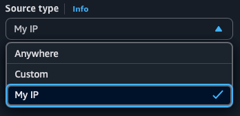

*Configure storage*

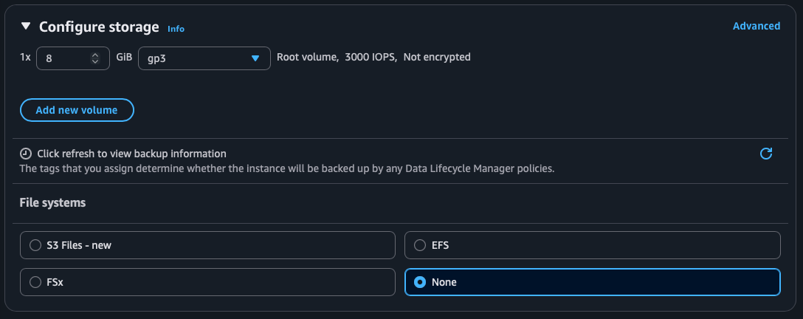

**SSH into the server**

```bash
ssh -i ~/.ssh/<key-file-name>.pem ec2-user@<server-IP-address>
```
Connecting to the EC2 instance via SSH is always done with the user *ec2-user*.

**Install Docker**

Note: The package manager used on this instance is *yum*. 

If a new instance was created the first stap should always be to update the
package manager.

```bash
sudo yum update
```

*Install Docker with yum*

```bash
sudo yum install docker
```

*Start Docker*

```bash
sudo service docker start
```

*Add user ec2-user to group docker*

```bash
sudo usermod -aG docker $USER
```
Note: This change will be effective after the next login.

**Deploy Docker image**

1. Login to Docker
    ```bash
    docker login
    ```
2. Download the image
    ```bash
    docker pull <repository-name>:<tag>
    ```
3. Run
    ```bash
    docker run -d -p <server-port>:<app-port> <repository-name>:<tag> 
    ```
4. Add port <server-port> to firewall inbound rules
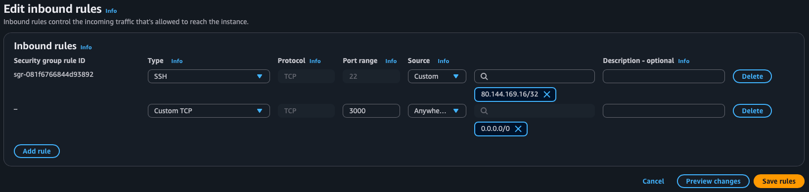
