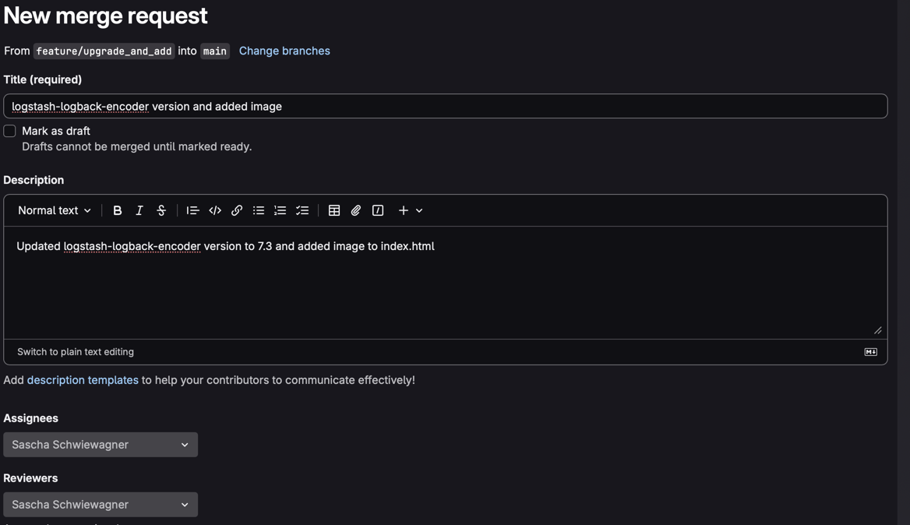

# Exercise - Version control with GIT

## Exercise 1 - Clone and create new repository

Clone the repository
```
git clone https://gitlab.com/twn-devops-bootcamp/latest/03-git/git-exercises.git
```

Change directory (project folder)
```
cd git-exercises
```

Check current remote
```
git remote -v
```

Change current remote to my remote
```
git remote set-url origin git@github.com:jackoCode/DevOps_Bootcamp_Exercise.git
```

Push everything to my repository
```
git push -u origin main
```

## Exercise 2 - .gitignore

Remove from Git cache
```
git rm -r --cached .
git add .
git commit -m "..."
git push
```
Add .gitignore file
```
touch .gitignore
vim .gitignore
git add .
git commit -m "added .gitignore file"
git push
```

## Exercise 3 - Feature branch

Create new feature branch and checkout
```
git checkout -b feature/upgrade_and_add
```

Check changes
```
git diff
```

Commit changes
```
git add .
git commit -m "Updated logstash-logback-encoder version to 7.3 and added image to index.html"
```

Push
```
git push --set-upstream origin featue/upgrade_and_add
git push
```

## Exercise 4 - Bugfix branch

Create new bugfix branch and checkout
```
git checkout -b bugfix/spelling_error
```

Correct the typo
```
vim Application.java
```

Check changes
```
git diff
```

Commit changes
```
git add .
git commit -m "Fixed spelling error 'starte' -> 'started'"
```

Push
```
git push --set-upstream origin bugfix/spelling_error
git push
```


## Exercise 5 - Merge request



## Exercise 6 - Fix merge conflict


## Exercise 7 - Revert commit

## Exercise 8 - Reset commit

## Exercise 9 - Merge

## Exercise 10 - Delete branch