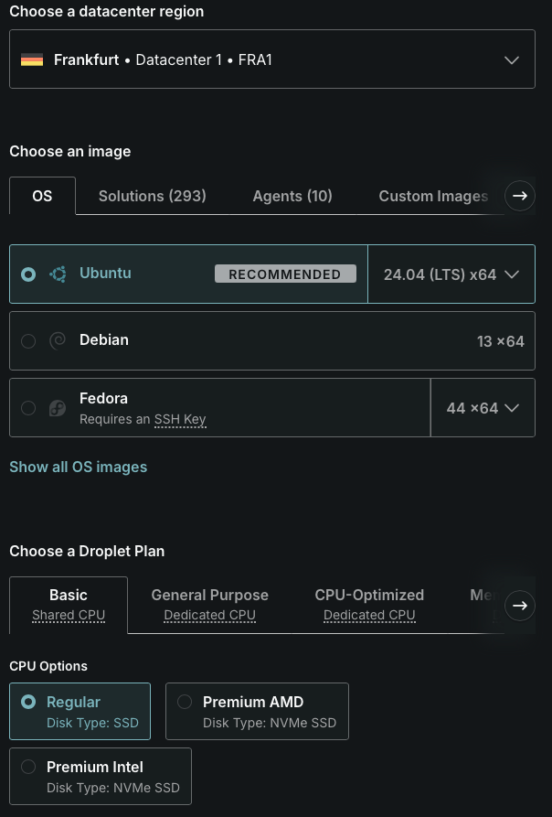
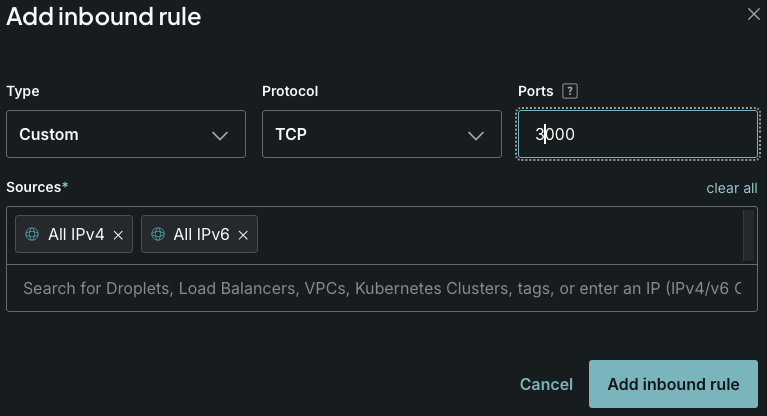

# Exercise - Cloud and IaaS

# Exercise 1


Exercise 2



Exercise 3

```
ssh root@104.248.33.90

apt upgrade
apt install -y nodejs npm
```

Exercise 4

```
scp bootcamp-node-project-1.0.0.tgz root@104.248.33.90:/root
```

Exercise 5

*Unpack*
```
root@exercise-iaas:~# tar -zxvf bootcamp-node-project-1.0.0.tgz
```

*Unpack result*
```
package/index.html
package/images/profile-ari.jpeg
package/images/profile-andrea.jpg
package/server.js
package/server.test.js
package/package.json
```

*Install dependencies*
```
npm install
```

*Run app*
```
node server.js
```

Exercise 6

*Add inbound rule to firewall*

