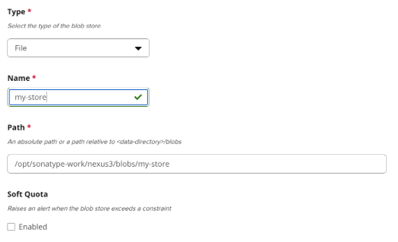
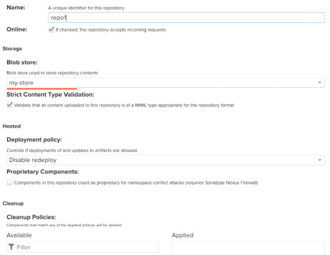
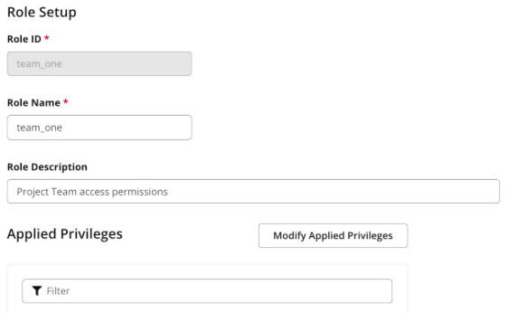
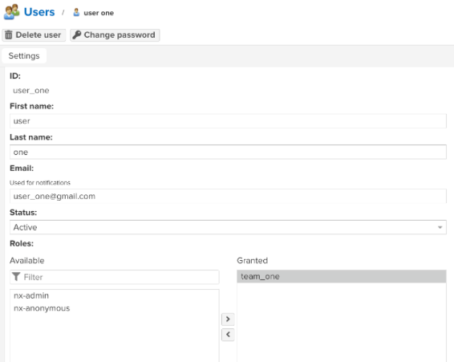
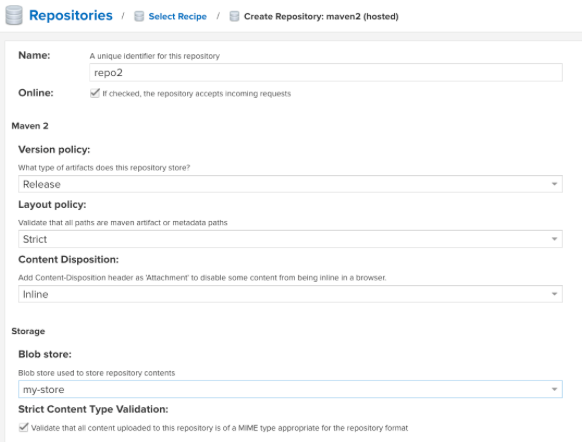
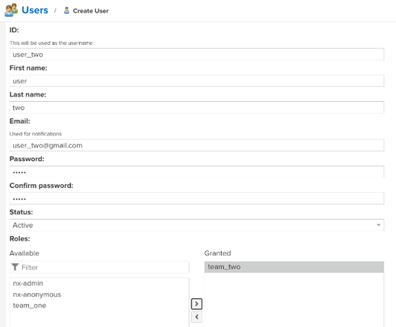
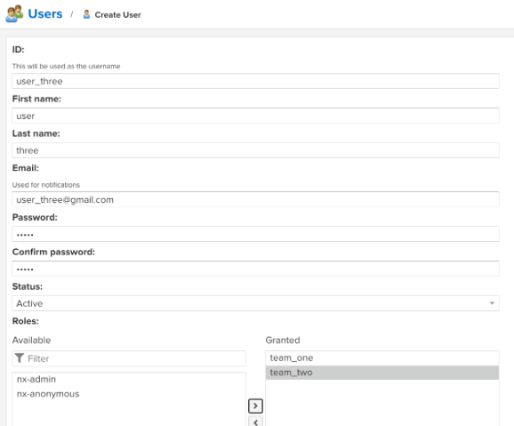

# Exercise - Artifact Repository Manger with Nexus

## Exercise 1

For installing Nexus see *Install and run Nexus* in
[documentation/06_artifact_repository_manager_nexus.md](../../documentation/06_artifact_repository_manager_nexus.md)

## Exercise 2

**Create a new npm repository**




## Exercise 3

**Create a Nexus user for the npm repository**




## Exercise 4

*see* [06_artifact_repository_manager_nexus.md](../../documentation/06_artifact_repository_manager_nexus.md) for building and publish a Node.js package.

## Exercise 5

**Create a Maven repository**



## Exercise 6

**Create a Nexus user for the Maven repository**



## Exercise 7

*see* [06_artifact_repository_manager_nexus.md](../../documentation/06_artifact_repository_manager_nexus.md) for building and publish a Maven jar file.

## Exercise 8

**Create new user to access both repositories**



**Run on droplet**

```bash
curl -u <username>:<password> -X GET 'http://<nexus-IP>:<port>/services/rest/v1/components?repository=<repository-name>&sort=version'
```

**Run ```wget``` + result from ```curl``` command**

**Run ```java -jar java-app-1.0.jar```**

## Exercise 9

**Create shell script** (with execute permission)

```bash
# Artifact info to json
url -u <username>:<password> -X GET 'http://<nexus-IP>:<port>/services/rest/v1/components?repository=<repository-name>&sort=version'

# Get download URL
artifactDownloadUrl=$(jq -r '.items[].assets[].downloadUrl | select(endswith(".jar"))' artifact.json)

# Download artifact
wget --http-user=<username> --http-password=<user-password> "$artifactDownloadUrl" -O java-app.jar

# Run java app
java -jar java-app.jar
```

**Run on droplet**

1. Create script file ```touch run-java.sh```
2. Add script (above) to the file using VIM
3. Set execute permission ```chmod +x run-java.sh```
4. Run script ```./run-java.sh```