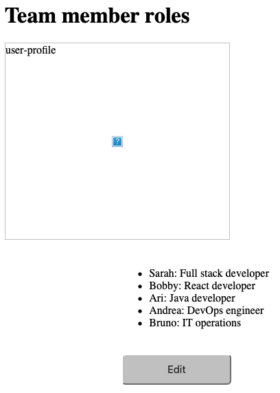
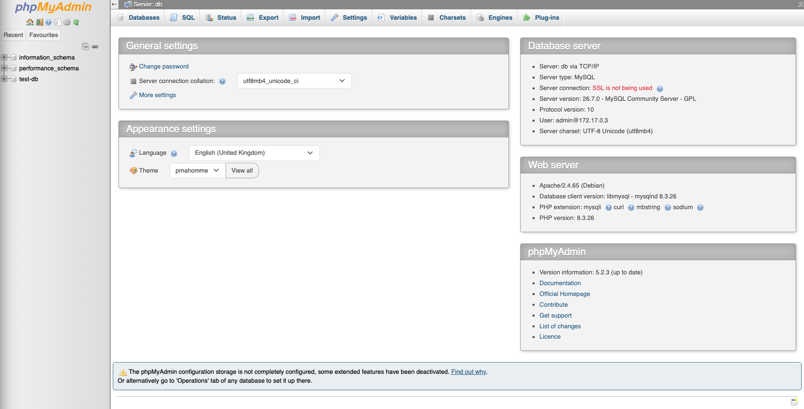
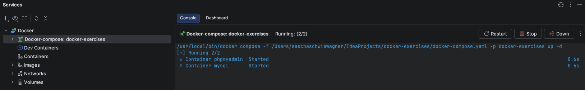

# Exercise - Containers with Docker

Use repository https://gitlab.com/twn-devops-bootcamp/latest/07-docker/docker-exercises

## Exercise 0

```bash
git clone git@gitlab.com:twn-devops-bootcamp/latest/07-docker/docker-exercises.git
cd docker-exercises 
git remote set-url origin git@gitlab.com:jackocodes-group/devops-docker-exercise.git
git push -u origin master
```

## Exercise 1

**Run MySQL Docker container**

```bash
docker run -p 3307:3306 --name mysql -e MYSQL_ROOT_PASSWORD=rootpw -e MYSQL_DATABASE=test-db -e MYSQL_USER=admin -e MYSQL_PASSWORD=adminpw -d mysql
09705e64c081fa2126688df0e7d90621e00a85c8cd1a18f27a27ba7d5adfd267
```
Had to change the port from *3306* tzo *3307* because a local MySQL instance was running on *3306*.
Therefore, updated the port in the *DatabaseConfig.java*.

**Build Java jar**

```bash
gradle build
Starting a Gradle Daemon (subsequent builds will be faster)

[Incubating] Problems report is available at: file:///Users/saschaschwiewagner/IdeaProjects/docker-exercises/build/reports/problems/problems-report.html

Deprecated Gradle features were used in this build, making it incompatible with Gradle 10.

You can use '--warning-mode all' to show the individual deprecation warnings and determine if they come from your own scripts or plugins.

For more on this, please refer to https://docs.gradle.org/9.6.1/userguide/command_line_interface.html#sec:command_line_warnings in the Gradle documentation.

BUILD SUCCESSFUL in 6s
7 actionable tasks: 7 executed
Consider enabling configuration cache to speed up this build: https://docs.gradle.org/9.6.1/userguide/configuration_cache_enabling.html
```
**Set environment variables**

```bash
export DB_USER=admin        
export DB_PWD=adminpw
export DB_SERVER=localhost
export DB_NAME=test-db
```
**Run Java app**

```
java -jar build/libs/docker-exercises-project-1.0-SNAPSHOT.jar

  .   ____          _            __ _ _
 /\\ / ___'_ __ _ _(_)_ __  __ _ \ \ \ \
( ( )\___ | '_ | '_| | '_ \/ _` | \ \ \ \
 \\/  ___)| |_)| | | | | || (_| |  ) ) ) )
  '  |____| .__|_| |_|_| |_\__, | / / / /
 =========|_|==============|___/=/_/_/_/

 :: Spring Boot ::                (v3.5.5)

2026-09-09T12:54:56.936+02:00  INFO 17007 --- [           main] com.example.Application                  : Starting Application v1.0-SNAPSHOT using Java 17.0.19 with PID 17007 (/Users/saschaschwiewagner/IdeaProjects/docker-exercises/build/libs/docker-exercises-project-1.0-SNAPSHOT.jar started by saschaschwiewagner in /Users/saschaschwiewagner/IdeaProjects/docker-exercises)
2026-09-09T12:54:56.938+02:00  INFO 17007 --- [           main] com.example.Application                  : No active profile set, falling back to 1 default profile: "default"
2026-09-09T12:54:57.384+02:00  INFO 17007 --- [           main] o.s.b.w.embedded.tomcat.TomcatWebServer  : Tomcat initialized with port 8080 (http)
2026-09-09T12:54:57.392+02:00  INFO 17007 --- [           main] o.apache.catalina.core.StandardService   : Starting service [Tomcat]
2026-09-09T12:54:57.392+02:00  INFO 17007 --- [           main] o.apache.catalina.core.StandardEngine    : Starting Servlet engine: [Apache Tomcat/10.1.44]
2026-09-09T12:54:57.406+02:00  INFO 17007 --- [           main] o.a.c.c.C.[Tomcat].[localhost].[/]       : Initializing Spring embedded WebApplicationContext
2026-09-09T12:54:57.407+02:00  INFO 17007 --- [           main] w.s.c.ServletWebServerApplicationContext : Root WebApplicationContext: initialization completed in 437 ms
2026-09-09T12:54:57.619+02:00  INFO 17007 --- [           main] com.example.Application                  : Java app started
2026-09-09T12:54:57.691+02:00  INFO 17007 --- [           main] o.s.b.a.w.s.WelcomePageHandlerMapping    : Adding welcome page: class path resource [static/index.html]
2026-09-09T12:54:57.823+02:00  INFO 17007 --- [           main] o.s.b.w.embedded.tomcat.TomcatWebServer  : Tomcat started on port 8080 (http) with context path '/'
2026-09-09T12:54:57.834+02:00  INFO 17007 --- [           main] com.example.Application                  : Started Application in 1.099 seconds (process running for 1.314)
2026-09-09T12:56:07.103+02:00  INFO 17007 --- [nio-8080-exec-1] o.a.c.c.C.[Tomcat].[localhost].[/]       : Initializing Spring DispatcherServlet 'dispatcherServlet'
2026-09-09T12:56:07.103+02:00  INFO 17007 --- [nio-8080-exec-1] o.s.web.servlet.DispatcherServlet        : Initializing Servlet 'dispatcherServlet'
2026-09-09T12:56:07.104+02:00  INFO 17007 --- [nio-8080-exec-1] o.s.web.servlet.DispatcherServlet        : Completed initialization in 1 ms
```
*localhost:8080*



## Exercise 2

**Run MySQL GUI container**

```bash
docker run -p 8083:80 --name phpmyadmin --link mysql:db -d phpmyadmin/phpmyadmin
```

*localhost:8083*



## Exercise 3

**docker-compose.yaml**

```yaml
services:

  mysql:
    image: mysql
    container_name: mysql
    environment:
      MYSQL_DATABASE: test-db
      MYSQL_USER: admin
      MYSQL_PASSWORD: adminpw
      MYSQL_ROOT_PASSWORD: rootpw
    ports:
      - "3307:3306"
    volumes:
      - mysql_data:/var/lib/mysql
    
  phpmyadmin:
    image: phpmyadmin
    container_name: phpmyadmin
    environment:
      PMA_HOST: mysql
    ports:
      - "8083:80"

volumes:
  mysql_data:
    driver: local
```
**Run docker-compose.yaml with IntelliJ**



## Exercise 4

## Exercise 5

## Exercise 6

## Exercise 7

## Exercise 8